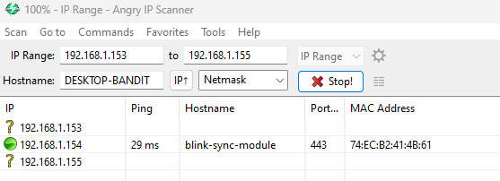
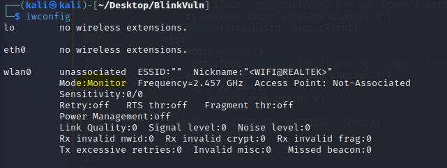
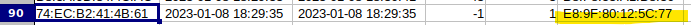
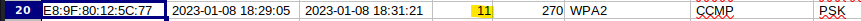

[Back](./)

## Disrupt IP Camera
In this test I wanted to see if Blink cameras are vulnerable to jamming and cause them to not record. The diagram of how the Deauth attack will take place is below. Once we find out the Mac address of the Sync Module we can send deauth packets at it using Airmon-ng and for the duration of the attack non of the cameras will be able to record or save its recordings.

### Requirments 
- Kali (Running in Virtualbox)
- Network adapter that can run on monitor mode. (Using Alpha AC1200)
> Followed these steps to install drivers
> 1. Update Repository
> `sudo apt upgrade -y`
> `sudo apt dist-upgrade -y`
> 2. Reboot the VM
> `sudo apt install realtek-rtl88xxau-dkms`
> `git clone [https://github.com/aircrack-ng/rtl8812au`
> `cd rtl8812au/ `
> `make`
> `sudo make install`

### Setup 
You'll need the BSSID of the Blink Sync Module, I am on the same network and Identiffied the IP and MAC of it. Blink is a Amazon product so looking up this mac address brings back this info,
[Mac Address Lookup Site](https://maclookup.app)
**Amazon Technologies Inc.**
You can also use AngryIPScanner

### Enable monitor mode 
1. Check for conflicting proccesses 
`airmon-ng check kill`
2. Start the adapter in monitor mode
`sudo airmon-ng start wlan0`

### Find target 
1. Run `airodump-ng -w output_scan wlan0`
> Looking in the *STATION* section for the Mac address, we can match the corrisponding **ESSID**, to find it easier we can output to a file using -w argument. Open the output file.

2. Locate the channel 
> By checking the top part of the output and match the newley found BSSID. 

3. Gathered info so far:

| HOSTNAME| IP|MAC |  BSSID | CH |
| ---- | ----- | ----| ---| --- |
|blink-sync-module | 192.168.1.154| 74:EC:B2:41:4B:61| E8:9F:80:12:5C:77 | 11 |
