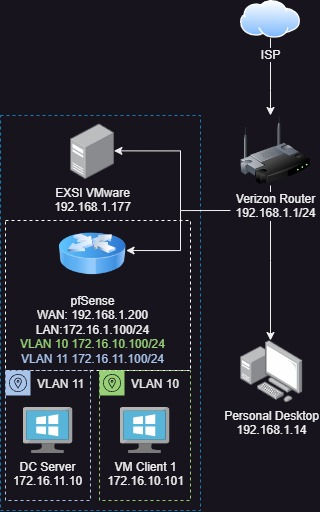
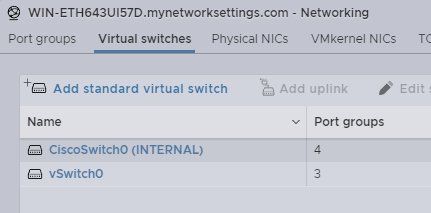
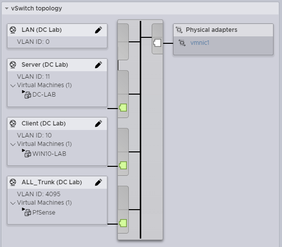
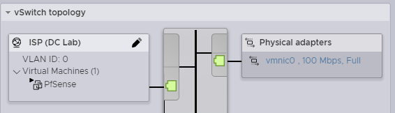
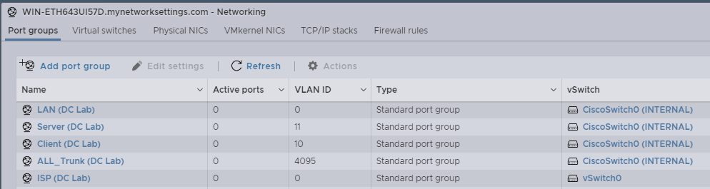
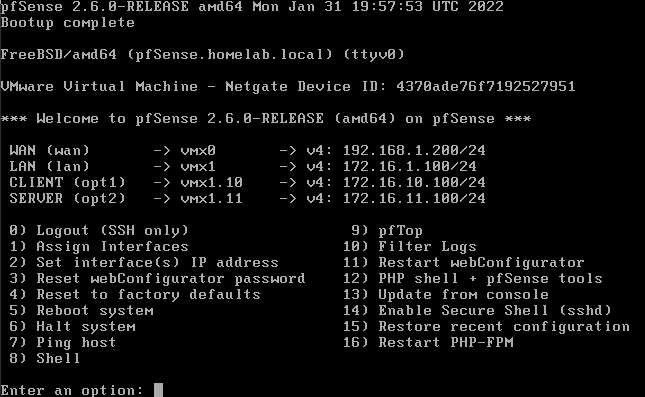
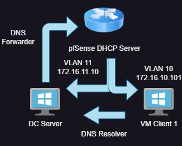

[Back](./)

## Current DC Lab Infrastructure with PFsense

## VMWare EXXi Requirements 
First we need two virtual switches for **Internal** and **External** communications. 
> Networking -> Virtual Switch -> Add standard virtual switch

Create the proper Port Groups for each of the VLAN network like below. Later they will be used to connect the VMs.

|Port Groups | VLAN ID |
|:----|:----|
| LAN (Internal) | 0 |
| Server (Internal) | 11 |
| Client (Internal) | 10 |
| ALL_Trunk (Internal) | 4096 |
| ISP (External) | 0 |

## PfSense Requirements
Create a Pfsense VM and add these networks 

Create Interface Assignments and enable DHCP on all of the Interfaces. Later we will make it also assign the DC's as the DNS resolver.

| Network | Address | DNS |
|:----|:----|:----|
| WAN | 192.168.1.200/24 | DHCP (Default) | 
| LAN | 172.16.1.100/24 | Router (Default) |
| CLIENT | 172.16.10.100/24 | 172.16.1.10 (AD-DC) |
| SERVER | 72.16. 11.100/24 | Router (Default) |

IP Address Alias For range of private IP address also known as **RFC1918**. This will make creating firewall rules a lot simpler to achieve network isolation. 
> Firewall -> Aliases -> IP Add -> Name: RFC1918
>  | IP | CIDR | 
>  |:----|:----|
>  |  192.168.0.0 |  16    | 
>  |  172.16.0.0   |   12  | 
>  |  10.0.0.0  |  8  | 

## Windows Server Requirements
In this lab I'm just using the 2016 version of Windows Server. So as long as you have an ISO uploaded to your datastore, you can provision a new server to begin to configure. First we need a static Ip Address so use these settings on the adapter.

| Network Adapter | Address |
|:-----| ----:|
| IP Address | 172.16.11.10 |
| Subnet mask | 255.255.255.0 |
| Default gateway | 172.16.11.100 |
| DNS1 | 127.0.0.1 |

**Configure Windows 2016 Server Roles**
- Add Active Directory Domain Service
> Name: `homelab.local` 
- Add DNS Server 
> DNS Forwarder configured to send DNS request from the Pfsense Router. `Set-DnsServerForwarder -IPAddress "172.168.11.100"`

| Image| Description |
| ----------- | ----------- |
|  | So the way it work is The Router is in charge of handing out DHCP addresses and the Domain Controller is in charge of resolving IP Addresses for the **Client** interface. At the samee time using the pfSense router as a DNS forwarde| 

